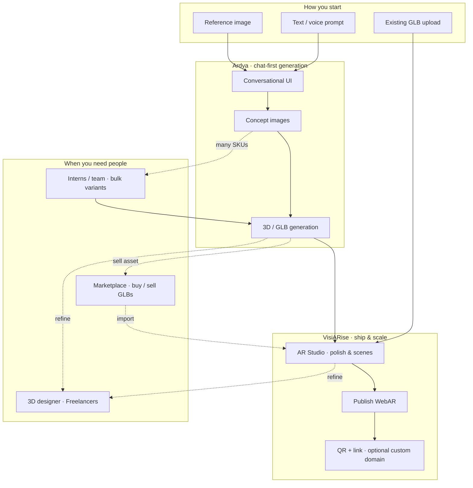
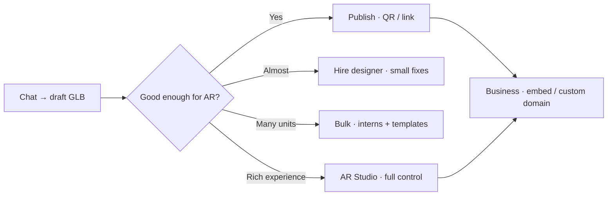

# VisiARise — introduction & proposed solution (pitch deck source)

Internal reference for **introduction slides**, **sustainability narrative**, and the **full product story** (aligned with the live site: Ardya chat → GLB → AR Studio / publish, Marketplace, Freelancers, Sustainability).  
Problem depth lives in [`text-to-ar-problem-landscape.md`](./text-to-ar-problem-landscape.md).

---

## Slide A — Introduction (headline + sustainability + AR)

**Title idea:** *Show the product live — not another showroom dummy.*

**Supporting lines**

- **Sustainability:** Cut down on physical demo units, one-off samples, and display churn. What used to be “print another prototype” becomes a **reusable digital twin** you can update without new material waste or floor space.
- **Live in the room:** Customers **scan a QR or open a link** on their phone — **no app install** — and see the product **in 3D from every angle**, in **their** lighting and space (WebAR), not a retouched photo.
- **Why it lands:** Younger buyers expect **interactive, eye-catching** experiences; static glass cases and mismatched catalog photos erode trust. AR closes the **“is this really what I get?”** gap when the pipeline is honest and fast enough to run at scale.

**Ultra-short version (one slide, three bullets)**

1. **Less waste** — fewer physical demos and throwaway models; digital-first merchandising.  
2. **Real context** — phone camera, real scale, orbit the asset in AR.  
3. **Shareable** — link or QR; same asset for web, sales, and campaigns.

---

## Slide B — The gap we fill (problem → promise)

**Problem (one sentence):**  
The journey from **words or a listing** to **trustworthy AR** is split across too many tools, subscriptions, and expert-only “studios” — so showrooms stay physical and e‑com stays flat.

**Promise (one sentence):**  
**VisiARise** is the layer where **text → image → 3D → AR** meets **publishing, people, and marketplace** — so teams can ship AR like they ship a link, and only pull humans or heavy tools when the use case demands it.

---

## Proposed solution — full platform story

### Core: one conversational interface

- **Text (and references) → image → 3D → AR** in a **single, chat-native flow** (Ardya for ideation and generation; VisiARise for polish and publish).  
- Feels familiar: like asking an assistant for a visual, then locking the one you want into something **real in the room** — not juggling five vendor dashboards.

### When AI isn’t enough — human paths (same ecosystem)

| Need | Path |
|------|------|
| **Tweak materials, proportions, brand fidelity** | **Hire a 3D designer** (Freelancers) for surgical edits on top of the generated base. |
| **Many SKUs / campaigns** | **Bulk output** — scale with **interns or junior creators** on briefs, templates, and review inside the same projects. |
| **Rich AR behavior** (placement, sequences, multi-asset scenes) | **AR Studio** — deeper control without forcing everyone through it on day one. |

### Asset lifecycle & monetization

- **You own a GLB you’re proud of** → **List on the Marketplace**; others buy **production-ready** meshes tied to the same pipeline (studio → AR).  
- **You need an asset** → Buy from Marketplace, then **open in Studio** and publish to AR — avoid paying twice for the same class of work.

### For businesses embedding AR in their product or site

- **Deploy with QR or shareable link** — standard WebAR path.  
- **Custom domain / branded experience** — white-label style trust for retailers, agencies, and OEMs (positioning: *their* URL, *your* engine).  
- *Implementation note for roadmap copy:* spell out what “custom domain” includes (DNS, SSL, analytics on that hostname) when you sell to enterprises.

### Two front doors (everyone covered)

1. **Already have a 3D model**  
   - **Generate AR in seconds** — upload / select GLB → publish — framed as **“as natural as ChatGPT for an image, but the output is something you walk around.”**  
2. **No 3D yet**  
   - **Built-in 3D generation** (and optional image step) so you’re not blocked before AR.

### Domain-specific (vertical depth)

- **Retail / footwear / furniture / automotive / avatars / education** — presets for **poly budget, tone, compliance copy, and template prompts** so each vertical doesn’t start from a blank chat.  
- Message: *We don’t give you a generic 3D toy; we give you defaults that match **where** you sell.*

### The “one hero asset, must be perfect” path

- **Buy a top-up** (credits / tier) for generation + export.  
- **Add a 3D designer** from Freelancers to **finish** the model for AR performance, PBR, and brand sign-off.  
- Outcome: **one flagship SKU or campaign** done right — used for **QR in-store**, **link in e‑com**, and **reuse next season** (sustainability + ROI story).

---

## Mermaid — end-to-end flow (how the product moves)

### Mermaid — escalation ladder (messaging: start simple)

---

## What the market often also asks for (sanity check)

You are strong on **unified narrative**, **human escalation**, **marketplace**, and **WebAR + QR**. Decks that win enterprise pilots often also mention (even as “coming soon” if not built):

- **Analytics** — scans, session length, device class, drop-off (ties to ROI story next to sustainability).  
- **Embeddable viewer** — iframe / JS snippet for existing PDPs and CMS.  
- **CAD / PLM handoff** — for manufacturing-heavy buyers (optional vertical).  
- **Access control** — private links, expiry, passworded demos for B2B sales rooms.  
- **Format pipeline** — clear export list (GLB, USDZ where relevant) and **performance budgets** for mid-range phones.

Use these as **FAQ backup**, not as a promise unless the roadmap matches.

---

## Suggested deck order (if this becomes multiple slides)

1. **Introduction** — sustainability + live AR + QR/link (Slide A).  
2. **Problem** — one line + visual from problem landscape.  
3. **Solution** — one interface + two front doors (have GLB / no GLB).  
4. **Escalation** — designer · bulk · AR Studio · Marketplace.  
5. **B2B** — QR, link, custom domain, vertical presets.  
6. **Proof** — product screenshot / short loop (hero demo from site).  
7. **Ask** — pricing tier, pilot, or waitlist (as appropriate).

---

*Living document — tune naming (Ardya vs product bundle) to match final go-to-market.*
